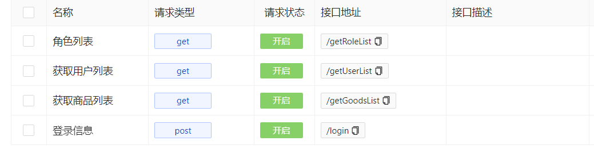
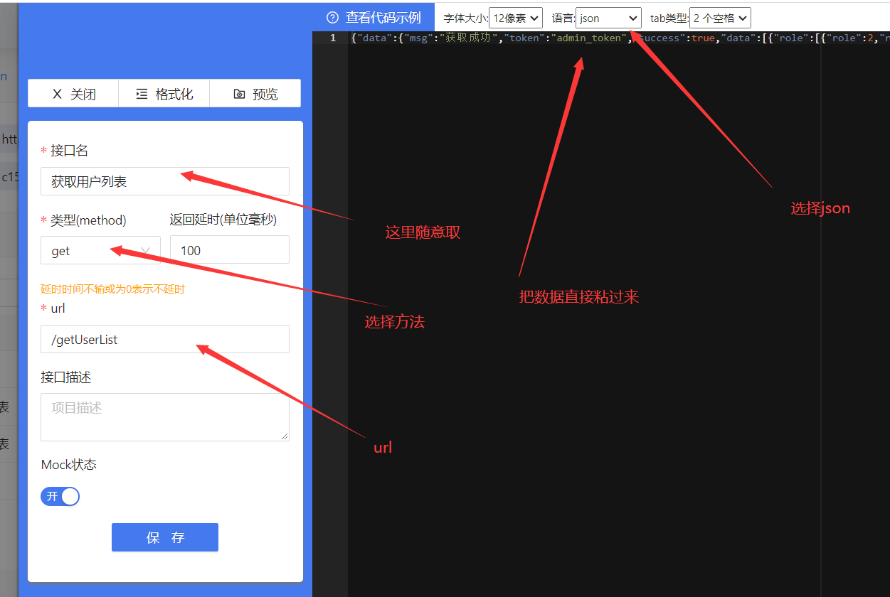

# Vue3-Vite-NaiveUI-Admin-Mock

Vue3-Vite-NaiveUI-Admin-Mock的自学练习项目。

原始项目来自于B站[一行行代码带你敲，Vue3+TS电商后台系统项目实战](https://www.bilibili.com/video/BV1nr4y1G73d?p=1 )

在练习过程中进行了基于Naive-UI的重构。同时也做了一些修改。

## 安装依赖

```sh
npm install
```

### 开发模式运行

```sh
npm run dev
```

### 打包

```sh
npm run build
```

## 数据与配置

数据使用Julia脚本随机生成，在`/dataTool`文件夹中可查看。文件夹准备的数据中user为100个，goods为200个。

Mock配置网址为[FastMock](http://129.204.116.48:3000/#/)

配置示例如下：



以用户数据为例，数据直接把`/dataTool`文件夹中json文件的数据粘过去即可：


